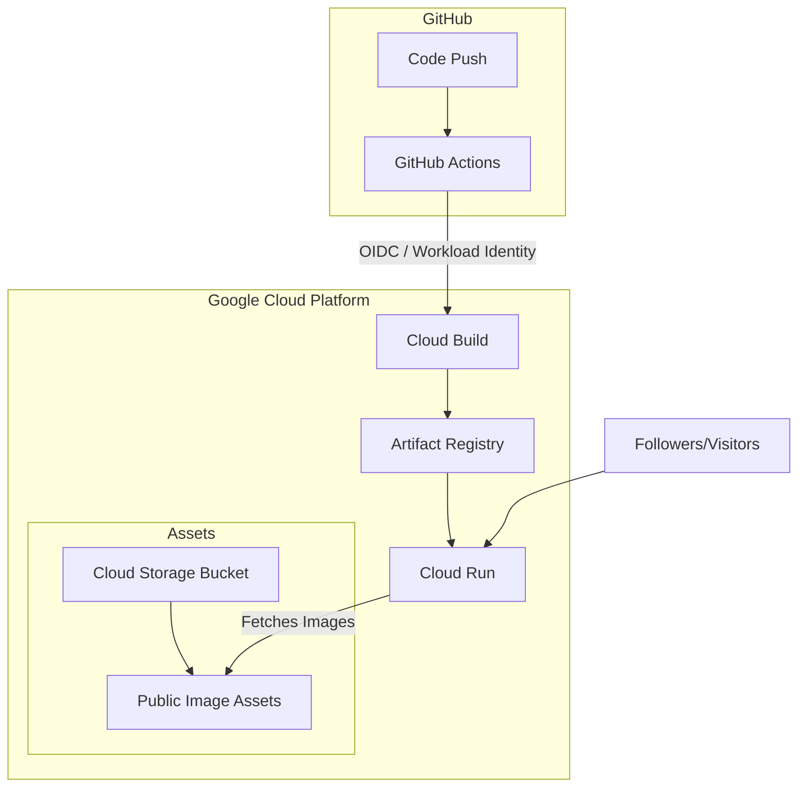

# 🏗️ System Architecture: Professional Expert Portfolio

This document outlines the architectural design and tech stack of the **Biswanath Giri (AI & Cloud Expert)** portfolio. The system is designed for high performance, maximum security, and serverless scalability.

---

## 🛰️ High-Level Cloud Architecture

The application follows a modern **Cloud-Native** approach, leveraging Google Cloud and GitHub Actions for a fully automated, keyless deployment lifecycle.



---

## 🛠️ Technology Stack

### **Frontend & UI**
- **Framework**: [Next.js 15+](https://nextjs.org/) (App Router)
- **Library**: React 19
- **Styling**: Tailwind CSS (Modern Glassmorphism & Google-inspired theme)
- **Animations**: Framer Motion (Smooth layout transitions and carousels)
- **Icons**: Lucide React
- **Type Safety**: TypeScript

### **Cloud & Infrastructure (GCP)**
- **Compute**: **Google Cloud Run** — Fully managed serverless container execution.
- **Image Registry**: **Artifact Registry** — Secure, regional storage for Docker images.
- **Asset Hosting**: **Google Cloud Storage (GCS)** — High-availability storage for the Photo Library and professional milestones.
- **Build System**: **Cloud Build** — Serverless container builders.

### **Security & Identity**
- **Auth Strategy**: **Workload Identity Federation (Keyless)**.
- **Identity**: OIDC-based handshake between GitHub and GCP. No static JSON keys are stored.
- **Principle of Least Privilege**: Dedicated Service Account (`github-actions-deployer`) with scoped IAM roles.

---

## 📦 Deployment Lifecycle (CI/CD)

The system implements a robust **GitOps** workflow:

1.  **Stage 1: Development**: Local development with `npm run dev`.
2.  **Stage 2: Version Control**: Pushing to the `main` branch.
3.  **Stage 3: Automated Build**: GitHub Actions triggers a multi-stage Docker build.
4.  **Stage 4: Keyless Handshake**: The workflow authenticates via a short-lived token generated by the Workload Identity Pool.
5.  **Stage 5: Scaleless Rollout**: Cloud Run performs a blue-green style deployment of the new container version.

---

## ⚡ Performance Optimizations

### **Container Optimization**
- **Multi-Stage Build**: Separates build dependencies from the runtime environment.
- **Alpine Linux Base**: Uses the ultra-slim `node:20-alpine` image to reduce the attack surface and download size.
- **Standalone Output**: Next.js packages only the minimal necessary files, bringing the image size down significantly.

### **Asset Delivery**
- **Next/Image Component**: Automatic image resizing, lazy loading, and optimization.
- **GCS Integration**: Images are served from specialized cloud storage, offloading bandwidth from the main compute instance.

### **Rendering Strategy**
- **Hybrid Rendering**: Combines Server Components for initial load speed and Client Components for high-interactivity sections (like the Photo Library).

---

## 📂 Project Structure

```text
├── .github/workflows/    # CI/CD Pipeline logic
├── src/
│   ├── app/              # Next.js App Router (Layouts & Pages)
│   ├── components/       # UI Components (Expertise, PhotoLibrary, etc.)
│   ├── data/             # Portfolio Data (Centralized Config)
│   └── styles/           # Global CSS and Tailwind Config
├── public/               # Static base assets
├── Dockerfile            # Optimized Multi-stage container config
├── deploy.sh             # Manual deployment & setup utility
└── next.config.ts        # Next.js configuration (Standalone mode)
```

**This architecture ensures that the portfolio is as scalable and professional as the AI and Cloud workloads it describes.**
