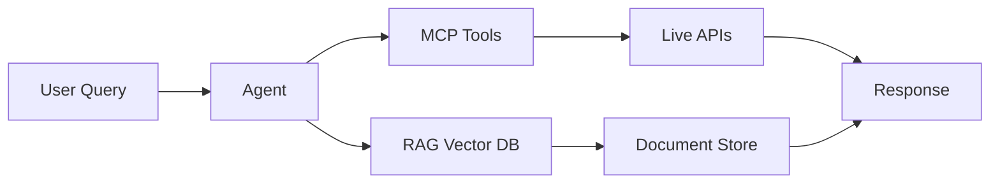

# MCP vs RAG: The Evolution of AI Context

The AI landscape is rapidly evolving. While **RAG (Retrieval Augmented Generation)** has been the go-to pattern for grounding LLMs in external knowledge, **MCP (Model Context Protocol)** is emerging as a more standardized approach.

## What is RAG?

RAG combines:
1. **Vector Database** (e.g., Pinecone, Weaviate)
2. **Embedding Model** (e.g., text-embedding-ada-002)
3. **LLM** (e.g., GPT-4, Claude)

```python
# Traditional RAG Flow
query = "What is Agentic AI?"
embeddings = embed(query)
docs = vector_db.search(embeddings, top_k=5)
context = "\n".join(docs)
response = llm.generate(f"Context: {context}\nQuestion: {query}")
```

### Limitations of RAG
- ❌ No standardization across tools
- ❌ Complex setup (vector DB, embeddings, chunking)
- ❌ Limited to text retrieval
- ❌ No real-time data access

## What is MCP?

**Model Context Protocol** is an open standard by Anthropic that allows LLMs to securely connect to external data sources and tools.

### Key Features
- ✅ **Standardized Interface**: One protocol for all integrations
- ✅ **Real-Time Access**: Live data from APIs, databases, files
- ✅ **Tool Calling**: Execute functions, not just retrieve text
- ✅ **Security**: Built-in permission model

```typescript
// MCP Server Example
const server = new MCPServer({
  name: "company-data",
  version: "1.0.0"
});

server.addTool({
  name: "get_revenue",
  description: "Fetch company revenue data",
  parameters: { year: "number" },
  handler: async ({ year }) => {
    return await db.query(`SELECT revenue FROM financials WHERE year = ${year}`);
  }
});
```

## When to Use What?

### Use RAG When:
- You have a large corpus of static documents
- Semantic search is the primary use case
- You need to cite sources

### Use MCP When:
- You need real-time data access
- You want to execute actions (not just retrieve)
- You're building a multi-tool agent system

## The Future: Hybrid Approach

The best systems will combine both:
- **MCP** for live data and tool execution
- **RAG** for semantic search over knowledge bases



## Conclusion

MCP represents a paradigm shift from "retrieval" to "integration". As the ecosystem matures, expect to see MCP become the standard for AI-native applications.

**The future is agentic, and MCP is the protocol that makes it possible.**
